<div align="center">



<h1>attract&#8209;mode</h1>

**A GitHub profile that renders itself, nightly, as an arcade cabinet.**

No image editor. No third-party stat-card service. Every glyph is drawn from a
hand-built 5×7 pixel font, and every number is fetched from the GitHub API by a
workflow that runs while you sleep.

<a href="LICENSE"></a>
<a href="SETUP.md"></a>


</div>

<br>

## Why this exists

Profile READMEs are usually assembled from hosted card services. That works
until it doesn't: those services rate-limit, they go down, and every profile
that uses them looks like every other profile that uses them.

`attract-mode` generates the whole thing inside your own repository. Nothing can
break because someone else's server had a bad day, and the result looks like
nothing else on the site.

<br>

## The cards

<div align="center">



<br><br>



<br><br>



<br><br>



</div>

Pick any subset. Drop the ones you don't want.

<br>

## Four palettes

Each is a complete set rather than a hue rotation — the relationships between
background, ink and accent are tuned per theme, not filtered from one original.

<div align="center">







</div>

```jsonc
{ "theme": "amber" }   // or "phosphor", "synth", "ice"
```

<br>

## Quick start

**1.** Click **Use this template → Create a new repository**. Name it **exactly
your GitHub username**, and make it **public**. That is GitHub's rule for
profile READMEs, not ours — `octocat` needs `octocat/octocat`.

**2.** Edit `profile.config.json`:

```json
{
  "login": "your-username",
  "tagline": "WHAT YOU DO, IN A SHORT LINE",
  "playerClass": "YOUR TITLE",
  "theme": "amber"
}
```

**3.** Go to **Settings → Actions → General → Workflow permissions** and choose
**Read and write**. Then **Actions → Refresh profile → Run workflow**.

Fifteen seconds later your profile is live, and it re-renders itself every night
from then on.

Full walkthrough, every configuration field, and troubleshooting:
**[SETUP.md](SETUP.md)**.

Handing the job to an AI assistant instead? Point it at **[AGENTS.md](AGENTS.md)**,
which is the same procedure written as a runbook, including the steps an agent
cannot do on your behalf.

<br>

## What makes it hold up

**Text is drawn, not typeset.** SVGs embedded in a README cannot load web fonts,
and system font stacks render at different metrics on every platform, which
would shift the layout. Every character is a bitmap, emitted as run-length-merged
rectangles and collapsed into a single `<path>` per block.

**The resting state is the truth.** Score digits spin up like a cabinet tallying
a score, but the real digit sits first in each column at offset zero. Anyone
with animations disabled sees real data, not the random decoy a naive
implementation leaves on screen.

**No figure depends on who generated it.** GraphQL reports commit and issue
counts relative to the calling token — a personal one sees hundreds more than a
workflow's. Every number on the cards comes from the public contribution graph
or the public repository list, so a scheduled run and a local run agree to the
byte.

**Randomness is seeded.** Star positions come from a seeded PRNG, so an
unchanged day produces an unchanged file and the nightly job commits nothing.

The full reasoning, and the rendering constraints that shaped it, is in
**[HOW-IT-WORKS.md](HOW-IT-WORKS.md)**.

<br>

## Requirements

Node 20 or newer. No dependencies to install — the entire generator is standard
library plus `fetch`.

```bash
GITHUB_TOKEN=$(gh auth token) npm run build
```

Then open `preview.html` to see every card with its animations.

<br>

## Contributing

Issues and pull requests are welcome — new palettes and new card types
especially. [CONTRIBUTING.md](CONTRIBUTING.md) covers the layout of the code and
how to check your work, which for this project means actually looking at the
rendered output rather than trusting the build log.

<br>

## Licence

[MIT](LICENSE). Use it, change it, ship it. Attribution is appreciated but not
required — the credits card can be turned off with one line of config.

<div align="center">
<br>

</div>
